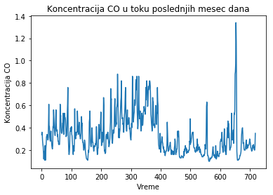
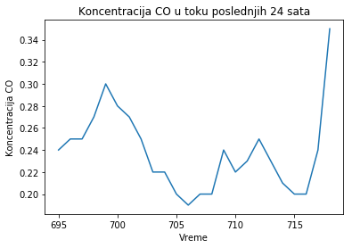
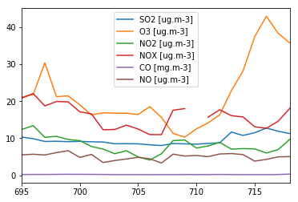

# Analiza i predvidjanje kvaliteta vazduha u Novom Sadu
**Autor**: *Nikola Selić IN-43-2017*

## Motivacija
Srbija, konkretno Beograd, je bio medju prvima, a kasnije i prvi, na listi zagadjenosti vezduha na svetu https://www.airvisual.com/world-air-quality-ranking. Podatak jeste zabrinjavajuć i, samim tim, glavna motivacija ovog rada je jedan od načina kako se može reagovati na tu pojavu. Agregirajući zvanične podatke o kvalitetu vazduha kao i vrste štetnih gasova u našoj atmosferi bi za cilj trebalo da informiše šire javne mase o opasnosti i štetnosti koje ti gasovi izazivaju.
(https://i.redd.it/g7c4hmz73vu31.jpg)

## Cilj
Glavna tema ovog projekta je predvidjanje kvaliteta vazduha u atmosferi koristeci podatke iz meteoroloskih stanica Srbije. Konkretno, koristimo podatke za Liman, Novi Sad. Obradjujemo sledeće faktore kvaliteta vazduha:
-   CO
-   SO2
-   O3
-   NO2
-   NOX
-   NO

## Hipoteza
Zato što postoji trend izmedju vremena (24 sata) i koncentracije CO i ostalih štetnih gasova, mozemo pretpostaviti buduću vrednost emisije gasova u periodu od jednog dana. 

## Algoritmi
Algoritmi koji bi se koristili u implementaciji projekta su:

#### Multivarijabilna Linearna Regresija
Multivariajilna linearna regresija se koristi kada imamo više promenljivih ili (eng. features) koje trebamo uzimati u obzir. Naša funkcija hipoteze se može napisati kao:

$ h_\theta(x) = \theta_0 + \sum\limits_{i=1}^{m} \theta_ix_i$

Odavde, možemo rešiti jednačinu pomoću algoritma opadajućeg gradijenta (eng. Gradient Descent)

#### Mutivarijabilni algoritam opadajuceg gradijenta
Multivarijabilni kriterijum optimalnosti je sličan kao i univarijabilni:

$J(\overrightarrow{\theta}) = \frac{1}{m} \sum\limits_{i=1}^{m} (h_\theta(x^{(i)}) - y^{(i)})^2$ (nekada $\frac{1}{2m}$ zbog lepšeg izvoda)

## Alati
Za izgradnju projekta tj. analizu podataka i implementaciju regresije u svrsi saznavanja budućih vrednosti, koristi se **Python** programski jezik,ili konkretnije, **Jupyter Notebook** okruženje.

Ostali alati i biblioteke koji su korisćeni su:
- numpy
    - Koristimo za rad nad matricama
- pandas
    - Omogucava dobru organizaciju podataka i rad sa ključevima kao i ostalim obeležijama
- requests
    - Služi za slanje http zahteva koji koristimo za pozivaje API-a
- selenium
    - Koristi se za automatsko korišćenje internet pretraživaca
- BeautifulSoup
    - Omogućava čitanje html stranica i izvlačenja informacija iz iste

## Podaci
Podaci su pribavljeni sa zvaničnog sajta Ministarstva zaštite životne sredine - Agencija za zaštitu životne sredine - [http://www.amskv.sepa.gov.rs/](http://www.amskv.sepa.gov.rs/)

Podaci se moraju prvo učitati i dodati u pandas dataframe i nakon toga srediti i urediti. Količina podataka je 718 redova tj. period od mesec dana.

### Pribavljanje podataka
Agencija za zaštitu životne sredine nema API ili drugi način pribavljanja podataka u nekom formatu, tako da za regionalne podatke moramo koristiti tehniku automatskog pribavljanja podataka (eng. web scraping)

Sav kod pribavljanja i čiscenja podataka se nalazi u [data_scripting.py](https://github.com/Selich/Serbian-Airquality/blob/master/data_scraping.py)

Podaci se ažuriraju svakog sata zato što su nam potrebni podaci koji su relevantni za dati trenutak.


Pregled tabela dataset-a:


```python
import pandas as pd
df = pd.read_csv("./data/amskv_data.csv")
df.head()
```


<div>
<style scoped>
    .dataframe tbody tr th:only-of-type {
        vertical-align: middle;
    }

    .dataframe tbody tr th {
        vertical-align: top;
    }

    .dataframe thead th {
        text-align: right;
    }
</style>
<table border="1" class="dataframe">
  <thead>
    <tr style="text-align: right;">
      <th></th>
      <th>Unnamed: 0</th>
      <th>Vreme</th>
      <th>SO2 [ug.m-3]</th>
      <th>O3 [ug.m-3]</th>
      <th>NO2 [ug.m-3]</th>
      <th>NOX [ug.m-3]</th>
      <th>CO [mg.m-3]</th>
      <th>NO [ug.m-3]</th>
      <th>V [m/s]</th>
      <th>dd [°]</th>
      <th>P [mb]</th>
      <th>t [°C]</th>
    </tr>
  </thead>
  <tbody>
    <tr>
      <th>0</th>
      <td>1</td>
      <td>2019-10-12 17:00:00</td>
      <td>20.78</td>
      <td>48.59</td>
      <td>21.68</td>
      <td>28.16</td>
      <td>0.34</td>
      <td>4.16</td>
      <td>0.42</td>
      <td>115.59</td>
      <td>1015.67</td>
      <td>22.81</td>
    </tr>
    <tr>
      <th>1</th>
      <td>2</td>
      <td>2019-10-12 18:00:00</td>
      <td>14.82</td>
      <td>35.95</td>
      <td>23.31</td>
      <td>29.73</td>
      <td>0.36</td>
      <td>4.22</td>
      <td>0.91</td>
      <td>131.52</td>
      <td>1015.93</td>
      <td>19.13</td>
    </tr>
    <tr>
      <th>2</th>
      <td>3</td>
      <td>2019-10-12 19:00:00</td>
      <td>12.47</td>
      <td>40.89</td>
      <td>18.90</td>
      <td>25.31</td>
      <td>0.33</td>
      <td>4.15</td>
      <td>0.95</td>
      <td>131.06</td>
      <td>1016.32</td>
      <td>17.23</td>
    </tr>
    <tr>
      <th>3</th>
      <td>4</td>
      <td>2019-10-12 20:00:00</td>
      <td>12.04</td>
      <td>44.82</td>
      <td>14.80</td>
      <td>22.19</td>
      <td>0.28</td>
      <td>4.78</td>
      <td>0.99</td>
      <td>137.33</td>
      <td>1016.57</td>
      <td>16.24</td>
    </tr>
    <tr>
      <th>4</th>
      <td>5</td>
      <td>2019-10-12 21:00:00</td>
      <td>12.45</td>
      <td>55.13</td>
      <td>11.64</td>
      <td>17.97</td>
      <td>0.25</td>
      <td>4.14</td>
      <td>0.86</td>
      <td>136.70</td>
      <td>1016.87</td>
      <td>15.72</td>
    </tr>
  </tbody>
</table>
</div>


## Korisni prikazi podataka
Neki prikazi podataka koji mogu bolje da objasne odnos podataka.


```python
df = df[df['CO [mg.m-3]'] < 4]
plt.title("Koncentracija CO u toku poslednjih mesec dana")
plt.xlabel("Vreme")
plt.ylabel("Koncentracija CO")
plt.plot(df["CO [mg.m-3]"])
```


    [<matplotlib.lines.Line2D at 0x7fdfb85dc410>]





Mozemo i uočiti konkretna kretanja u roku od 24h.


```python
plt.title("Koncentracija CO u toku poslednjih 24 sata")
plt.xlabel("Vreme")
plt.ylabel("Koncentracija CO")
plt.plot(df["CO [mg.m-3]"].tail(24))
```


    [<matplotlib.lines.Line2D at 0x7fdfb8aaa550>]





Možemo i videti kretanja ostalih štetnih gasova u toku poslednjih 24 sata.


```python
df.tail(24).plot(y=["SO2 [ug.m-3]","O3 [ug.m-3]","NO2 [ug.m-3]","NOX [ug.m-3]","CO [mg.m-3]","NO [ug.m-3]"])
```


    <matplotlib.axes._subplots.AxesSubplot at 0x7fdfb31a8bd0>





## LIteratura
- https://www.ritchieng.com/multi-variable-linear-regression/
- https://cmertin.github.io/Predicting-Air-Quality.html
